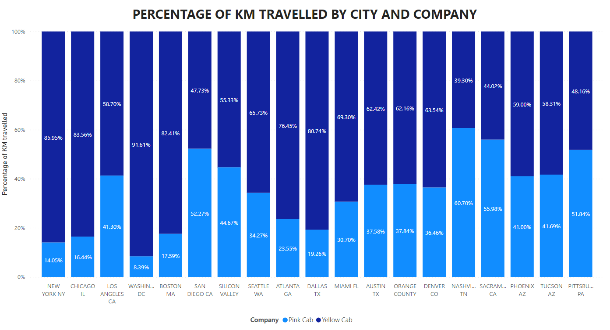
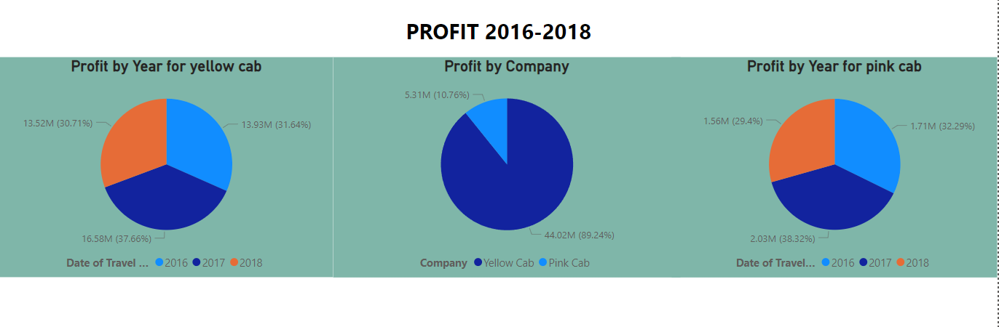
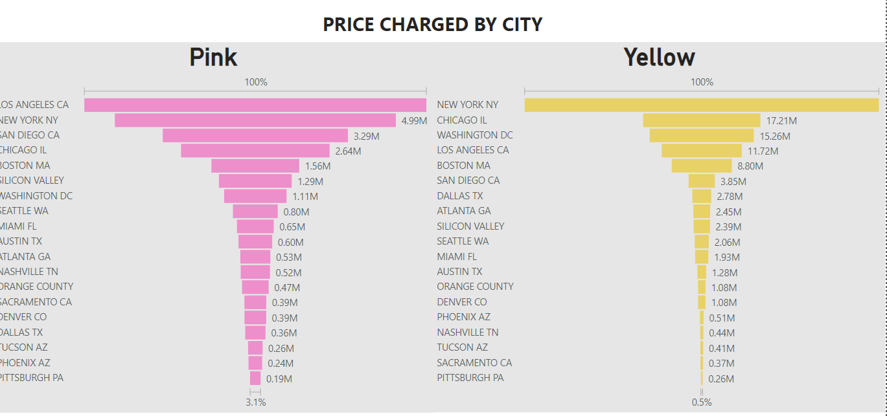
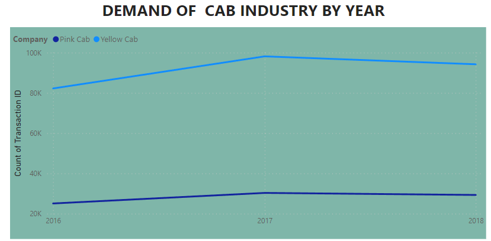
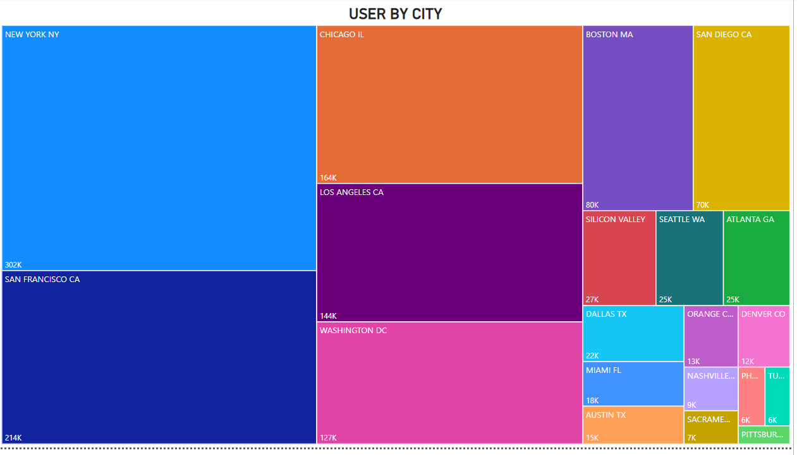
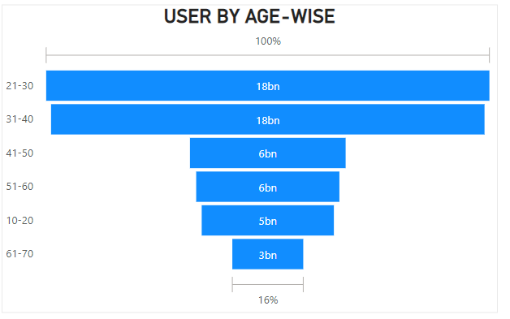
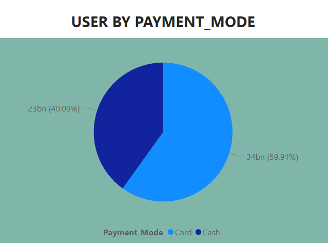
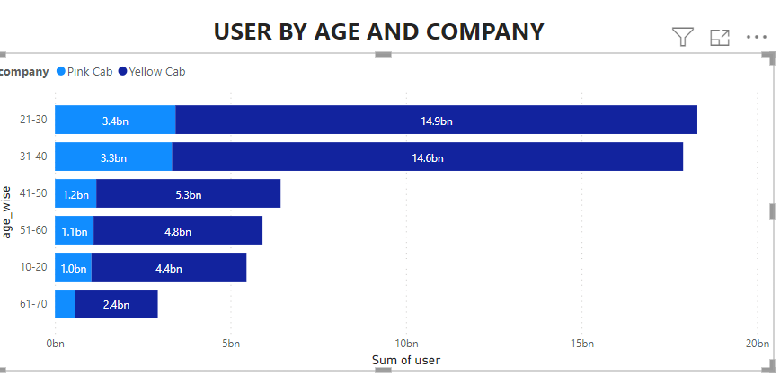

# US-Cab-Analysis

## Introduction

The project involves analyzing the dataset using Power BI. The primary objective of the project is to create visualizations to deliver insights on the pink and yellow cab of US.

## Dataset

* From [Kaggle](https://www.kaggle.com/datasets/nishantdhingra/cabs-fare-data)
* The dataset contains four different files- cab,city,customer and transaction

## Tools

* Power query editor
* Related function 

## Modelling

## Problem Statement

* Percentage of distance covered by each company in the same city.
* Profit shared by the cab in the year from 2016 to 2018.
* Price charged by both yellow and pink cab for each of the city. 
* Demand of cab industry by year
* Cab users city-wise
* Cab users age-wise
* Cab users payment-wise
* Cab users age-wise and company-wise (yellow or pink)

## Visualizations

* Percentage of distance covered by each company in the same city.

* Profit shared by the cab in the year from 2016 to 2018.

* Price charged by both yellow and pink cab for each of the city. 

* Demand of cab industry by year

* Cab users city-wise

* Cab users age-wise

)

* Cab users payment-wise

)

* Cab users age-wise and company-wise (yellow or pink)

)

## Insights

* There are more number of yellow cabs than pink cabs.
* The profit generated by both the cabs commbined is highest in 2017.
* The price charged by pink cab is highest in los Angeles while the price charged by yellow cab is highest in New York.
* New York has the highest number of cab users.
* People in the age group 21-30 uses the cab the most.
* Most of the cab payments are done by card.

